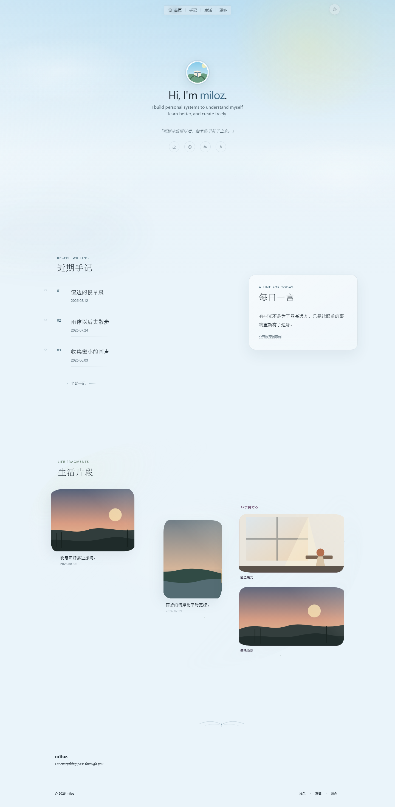
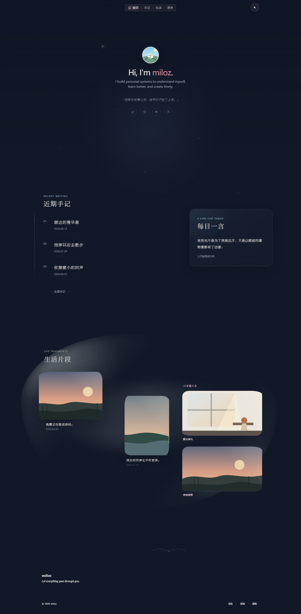
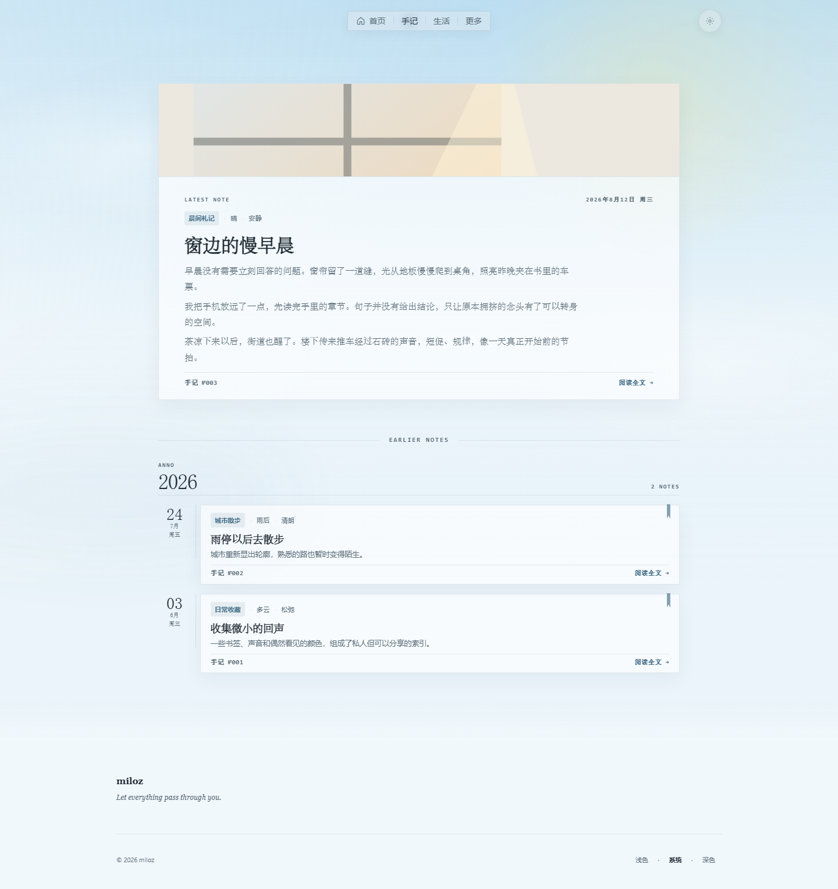
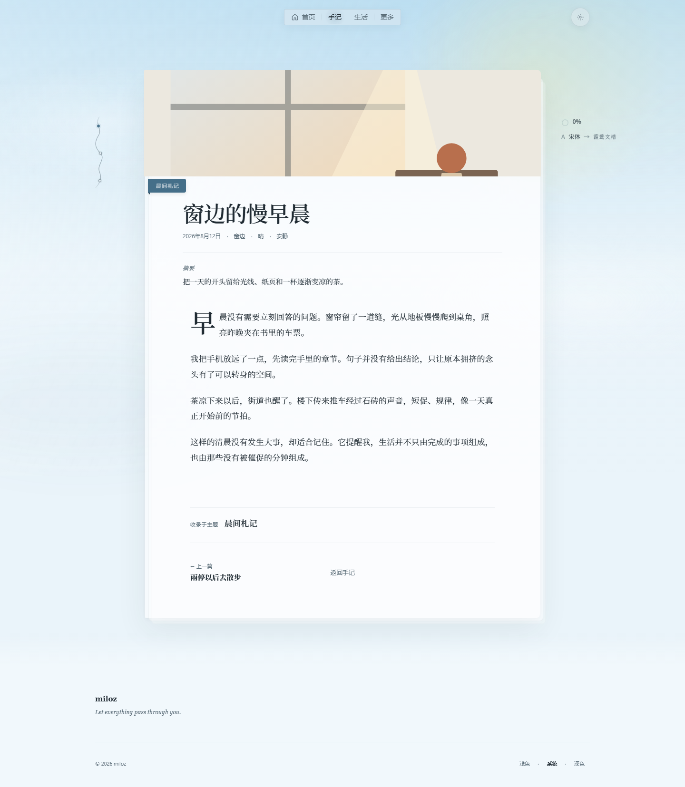
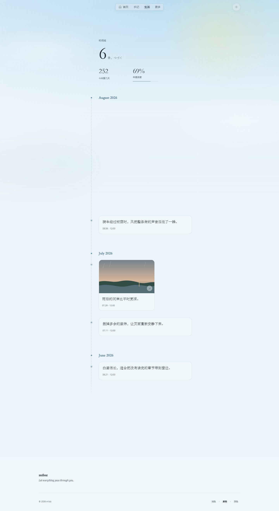
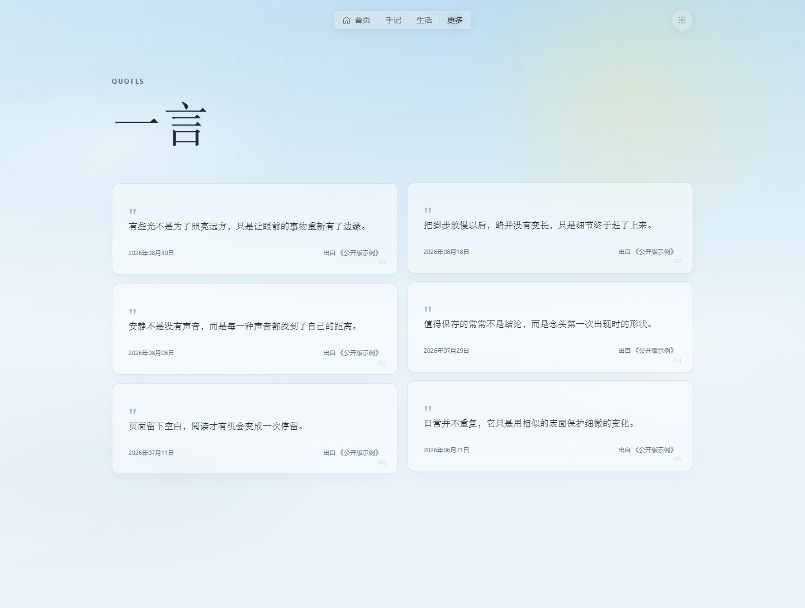

<h1 align="center">Milozpace</h1>

<p align="center">
  一个可以直接改造成你自己的、本地优先的静态个人站模板。
</p>

<p align="center">
  <em>A local-first personal website starter for notes, life fragments, and words.</em>
</p>

<p align="center">
  <a href="https://github.com/Milozpace/milospace/actions/workflows/ci.yml"></a>
  <a href="https://github.com/Milozpace/milospace/releases/latest"></a>
  <a href="LICENSE"></a>
  
</p>

<p align="center">
  <a href="#快速开始">快速开始</a> ·
  <a href="#换成你自己的内容">定制内容</a> ·
  <a href="docs/architecture.md">架构说明</a> ·
  <a href="docs/content-and-privacy.md">隐私边界</a>
</p>

Milozpace 从一个真实个人站中提纯而来，保留首页、手记、生活、一言和关于五类完整页面，以及浅深色主题、响应式排版、文章阅读工具和克制的入场动效。内容全部来自仓库内的 Markdown、JSON 与本地图片；不需要账号、数据库、CMS、环境变量或外部内容服务。

<table>
  <tr>
    <td width="50%" align="center">
      <br>
      <sub>浅色主题</sub>
    </td>
    <td width="50%" align="center">
      <br>
      <sub>深色主题</sub>
    </td>
  </tr>
</table>

## 适合怎样的个人站

- 想从一个已经完成设计与响应式适配的成品开始，而不是从空白模板搭建。
- 想用本地文件维护文章、生活片段和短句，不引入数据库或内容后台。
- 想获得完整静态输出，部署到任意静态托管平台。
- 在意浅深色主题、移动端阅读、键盘操作和 `prefers-reduced-motion`。
- 希望公开源码与私人内容、生产凭据和部署配置保持清晰边界。

## 快速开始

需要 Node.js 20.19 或更高的 20.x，或者 Node.js 22.12 及以上版本，并使用 npm。

```bash
npm ci
npm run dev
```

打开终端显示的本地地址即可。构建并预览完整静态站：

```bash
npm run build
npm run preview
```

`npm run build` 会生成可独立托管的 `out/`；默认预览地址为 `http://127.0.0.1:4173`。

## 换成你自己的内容

1. 在 `src/site.config.ts` 中替换站点名称、简介、导航和链接。
2. 用自己的公开内容替换 `content/demo/` 下的 Markdown 与 JSON。
3. 把本地图片放入 `public/`，并更新文章或 Life 记录中的资源路径。
4. 按需调整 `src/styles/`，然后运行完整检查并人工查看桌面端与移动端。

文章文件名就是 URL slug；frontmatter 必须包含 `title`、`summary`、`date`，可选 `cover`、`topic`、`weather`、`mood`、`place`。内容加载器会拒绝重复 slug、缺失字段、外部图片 URL 和不存在的本地资源。

| 内容或页面 | 主要入口 |
|---|---|
| 站点名称、介绍与导航 | `src/site.config.ts` |
| Markdown 手记 | `content/demo/articles/` |
| Life 生活片段 | `content/demo/life.json` |
| Says 原创短句 | `content/demo/says.json` |
| 示例图片与站点资源 | `public/demo/`、`public/` |
| 页面与视觉样式 | `src/app/`、`src/styles/` |

更完整的字段示例、替换顺序和检查事项见[定制指南](docs/customization.md)与 [Life 本地内容说明](docs/life-local-content.md)。

<details>
<summary><strong>查看更多页面预览</strong></summary>

<table>
  <tr>
    <td width="50%" align="center"><br><sub>手记列表</sub></td>
    <td width="50%" align="center"><br><sub>文章阅读</sub></td>
  </tr>
  <tr>
    <td width="50%" align="center"><br><sub>Life 时间线</sub></td>
    <td width="50%" align="center"><br><sub>Says 短句</sub></td>
  </tr>
</table>

另外还有 [Life 深色移动端](docs/screenshots/life-dark-mobile.png)和[关于页](docs/screenshots/about-light-desktop.png)预览。

</details>

## 静态架构与隐私边界

页面只在构建期读取本地 demo 内容。浏览器拿到完整静态 HTML 后，由小型客户端组件接管主题、导航、首页/Life/Says 动效、照片查看器和文章阅读工具。公开运行时不连接 CMS、数据库、生产域名或外部内容 API。

```text
Markdown / JSON / 本地图片
          ↓ 构建期读取与校验
      Next.js App Router
          ↓ static export
         out/
```

公开版与私人正式站独立演进。不要把私人文章、照片、头像、社交账号、后台代码、云端凭据、生产配置或未经授权的素材提交到这个仓库。详细设计关系见[架构说明](docs/architecture.md)，公开内容规则见[内容与隐私](docs/content-and-privacy.md)。

## 质量检查

```bash
npm run check
npm test
npm run build
npm run test:e2e
npm run release:check
```

CI 会在 push 与 pull request 时执行类型检查、Lint、单元测试、静态构建和发行边界检查。`test:e2e` 另外覆盖正式路由、主题持久化、导航、阅读工具、移动端和 reduced-motion 行为。

<details>
<summary><strong>项目目录</strong></summary>

```text
content/demo/       可直接替换的本地示例内容
public/demo/        原创示例图片
src/app/            页面与路由
src/components/     导航、主题、动效与阅读控件
src/lib/            内容读取和发行边界
src/styles/         壳层、页面、阅读与响应式样式
tests/              内容、逻辑和浏览器验收
docs/               架构、定制、隐私边界与截图
scripts/            本地预览与发行检查
```

</details>

## 文档

| 文档 | 用途 |
|---|---|
| [定制指南](docs/customization.md) | 替换名称、文章、Life、Says 和本地图片 |
| [架构说明](docs/architecture.md) | 理解构建期内容与浏览器端交互的边界 |
| [内容与隐私](docs/content-and-privacy.md) | 判断哪些内容适合进入公开仓库 |
| [发行流程](docs/release-process.md) | 维护版本、检查、tag 与 GitHub Release |
| [正式站设计同步指南](docs/upstream-design-sync.md) | 在不带入私人数据的前提下同步视觉改进 |

## 当前版本

`v1.0.0` 是 Milozpace 的首个公开稳定版本。查看 [v1.0.0 发行说明](docs/releases/v1.0.0.md)与 [完整变更记录](CHANGELOG.md)。

## 许可与品牌

源代码以及本仓库专门制作的 demo 内容和抽象插画采用 [MIT License](LICENSE)。Milozpace 名称与字标、未包含在仓库中的个人内容和身份资产不因代码开源而授权；公开自己的版本前，请在 `src/site.config.ts` 中更换名称与标识。

第三方字体许可、安全反馈和更细的权利边界分别见 [THIRD_PARTY_NOTICES.md](THIRD_PARTY_NOTICES.md)、[SECURITY.md](SECURITY.md) 与 [CONTENT_LICENSE.md](CONTENT_LICENSE.md)。
